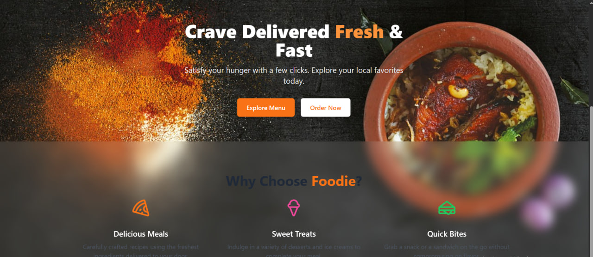

# 🍔 Foodie - Modern React Food Delivery Web App

A sleek, responsive food delivery web application built with **React**, **Tailwind CSS**, **Framer Motion**, and **Firebase**. Users can browse a dynamic menu, add items to their cart, and place orders with a beautiful, animated UI experience.



---

## 🚀 Features

- 🛒 **Add to Cart** functionality with quantity updates
- 📦 **Cart Sidebar** with animations (Framer Motion)
- 🔐 **Login/Signup** routes (UI only)
- 🧾 **Order Summary Page** with Firebase Firestore integration
- 🌐 **Responsive & modern UI** using Tailwind CSS
- 🔄 **Animated page transitions** and interactions
- 📁 Organized and scalable component structure

---

## 📂 Project Structure

foodie-app/
├── public/
│ └── bg-food.jpg (background image)
├── src/
│ ├── assets/
│ ├── components/
│ │ ├── Cart.jsx
│ │ ├── Navbar.jsx
│ ├── context/
│ │ └── CartContext.jsx
│ ├── pages/
│ │ ├── Home.jsx
│ │ ├── Menu.jsx
│ │ ├── Login.jsx
│ │ ├── Signup.jsx
│ │ ├── OrderSummary.jsx
│ ├── App.jsx
│ ├── main.jsx
│ └── firebase.js
└── README.md

yaml
Copy
Edit

---

## ⚙️ Tech Stack

- **React** — frontend framework
- **React Router DOM** — routing
- **Tailwind CSS** — modern styling
- **Framer Motion** — animation
- **Firebase Firestore** — backend database
- **Lucide Icons** — icon set

---

## 🧪 Getting Started

### 1. Clone the repo

```bash
git clone https://github.com/yourusername/foodie-app.git
cd foodie-app
2. Install dependencies
bash
Copy
Edit
npm install
3. Set up Firebase
Create a Firebase project at https://console.firebase.google.com

Enable Firestore Database

In src/firebase.js, add your config:

js
Copy
Edit
// src/firebase.js
import { initializeApp } from 'firebase/app';
import { getFirestore } from 'firebase/firestore';

const firebaseConfig = {
  apiKey: 'YOUR_API_KEY',
  authDomain: 'YOUR_AUTH_DOMAIN',
  projectId: 'YOUR_PROJECT_ID',
  // ...
};

const app = initializeApp(firebaseConfig);
export const db = getFirestore(app);
4. Run the app
bash
Copy
Edit
npm run dev
📦 Deployment
You can deploy this app easily with:

Vercel: https://vercel.com

📸 Screenshots
Home Page (Hero + Features)	Menu Page	Cart Sidebar

🙌 Acknowledgements
React

Tailwind CSS

Framer Motion

Firebase

Lucide Icons

💡 Future Improvements
✅ User Authentication

✅ Payment Integration (e.g., Stripe)

✅ Order History Page

✅ Admin Panel for managing menu items

🧑‍💻 Author
Lidiya Alemayehu
Software Engineering Student • Frontend Dev
📧 lilaalex94@gmail.com
📍 Addis Ababa, Ethiopia

📝 License
MIT License. Feel free to use and modify this project.
